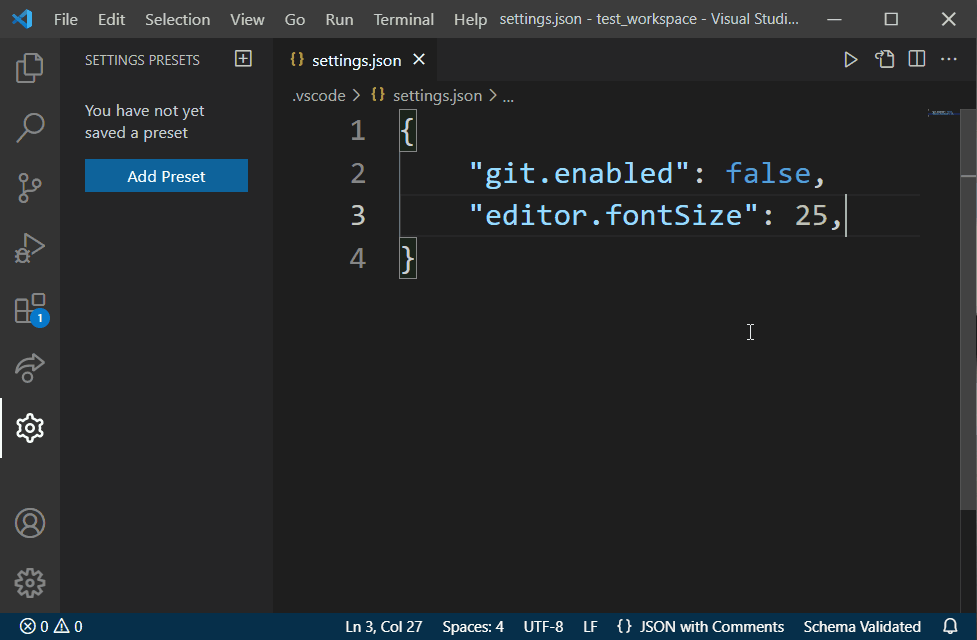

# Settings Presets extension for Visual Studio Code

A vscode extension for applying settings presets to the workspace

## Features

Add in a panel to save/load settings preset for your workspace

- Presets are stored in the user settings, and synced by vscode's built-in settings sync
- Also supports launch.json and tasks.json
- Applying a preset will merge the preset into the current workspace settings

